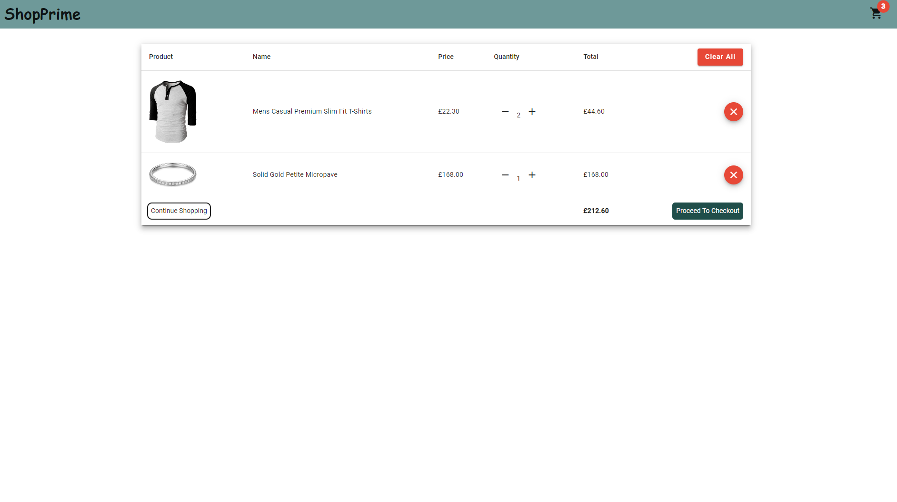

# ShopPrime
> ShopPrime is an e-commerce website using Angular 15.

## Features
The user has the ability to:
- Filter products based on their categories
- Sort products based on the highest or the lowest price
- Add items to basket
- Edit the basket(removing or adding more items)
- Proceed to checkout

## Tech Stack
- Angular
- Typescript
- Tailwindcss
- MaterialUi
- Express
- Stripe

## Installation
- First, run `npm i` to install the dependencies (need node.js for npm)
- Then, run `ng serve` to run the app via <a href="http://localhost:4200">localhost<a/>

## Future development
1. In the future, I can add more functionality to the website, such as the ability to filter products by brand or customer review.
2. I would implement MySQL or MongoDB for my database.
3. A registration feature should be available on the site so that users can keep track of the items that have been added to their baskets and post reviews.
